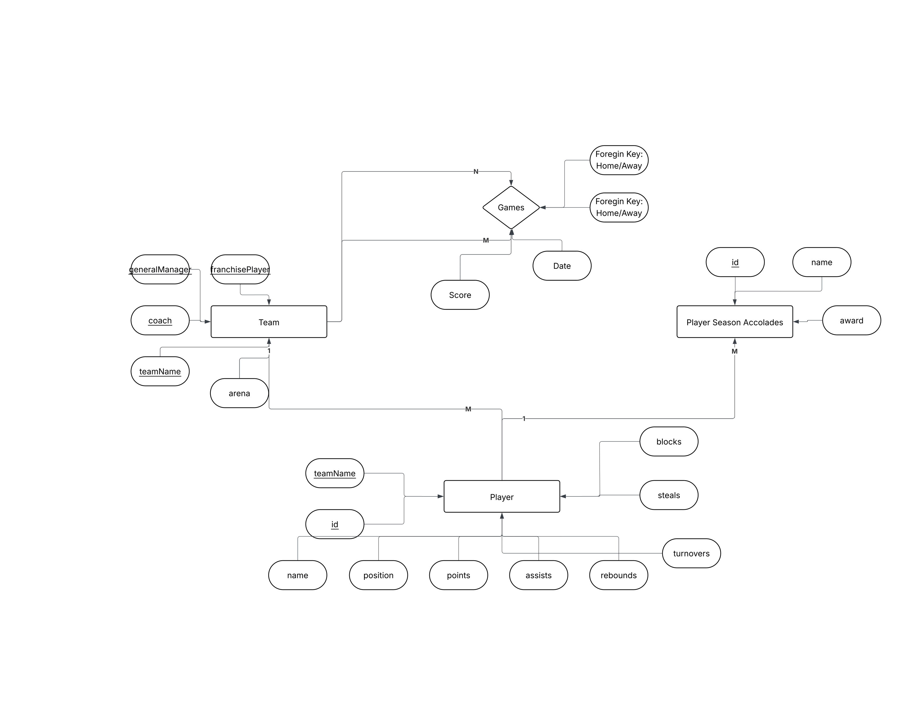

# NBA RDBMS Project (ITC 341)

A relational database project modeling NBA teams, players, season accolades, and
game results, built for Oracle Database using SQL*Loader for data ingestion.

This project was built for ITC 341 and demonstrates core RDBMS concepts: entity
design, primary/foreign key relationships, and bulk data loading from flat files
into a normalized schema.

## Entity-Relationship Model



An earlier draft of the diagram is also included for reference: [`diagrams/NBA-ER-Diagram.png`](diagrams/NBA-ER-Diagram.png).

**Entities:**
- **Teams** — `TeamKey` (PK), team name, GM, coach, franchise player (FK → Players), arena
- **Players** — `PlayerID` (PK), name, `TeamKey` (FK → Teams), season stats (points, assists, rebounds, turnovers, steals, blocks)
- **Accolades** — `Id` (FK → Players), accolade/award name
- **Games** — relationship entity tracking Home team, Away team, score, and date

Note: `Teams.FranchisePlayer` and `Players.TeamKey` reference each other, so
there's a circular foreign key dependency between these two tables. This is
addressed below in the load order.

## Project Structure

```
.
├── sql/
│   ├── table_creation.sql     # DDL for Players, Teams, Accolades
│   └── queries.sql            # Sample queries against the schema
├── control/
│   ├── team_data.ctl          # SQL*Loader control file — Teams
│   ├── player_data.ctl        # SQL*Loader control file — Players
│   ├── accolades_data.ctl     # SQL*Loader control file — Accolades
│   ├── game_data.ctl          # SQL*Loader control file — Games
│   └── load.sh                # Runs all sqlldr commands in order
├── data/
│   ├── itc_341_team_data.txt
│   ├── itc_341_player_data.txt
│   ├── itc_341_accolades_data.txt
│   ├── itc_341_games_data.txt
│   └── prev_accolade.txt      # Reference file with player names attached to each accolade
├── diagrams/
│   ├── nba-er.png             # Current ER diagram
│   └── NBA-ER-Diagram.png     # Earlier draft of the ER diagram
└── notes.txt                  # Working design notes from development
```

## Requirements

- Oracle Database (tested against an Oracle instance via SQL*Net)
- SQL*Loader (`sqlldr`) client tools installed and on your `PATH`
- A SQL client (SQL*Plus, SQL Developer, etc.) to run the DDL and queries

This project is Oracle-specific. The control files and `sqlldr` syntax will not
work against MySQL, PostgreSQL, or SQL Server without modification.

## How to Run

### 1. Create the schema

Connect to your Oracle database with a SQL client and run:

```sql
@sql/table_creation.sql
```

> **Known limitation:** `table_creation.sql` currently defines `Players`, `Teams`,
> and `Accolades`, but not `Games`. `control/game_data.ctl` loads into a `Games`
> table that must exist first, or that load step will fail. Add a `CREATE TABLE
> Games (...)` statement before running the Games load step.

### 2. Set your connection credentials

Do **not** hardcode credentials in any script you commit. Set them as
environment variables in your shell:

```bash
export ORACLE_USER=your_username
export ORACLE_PASS=your_password
export ORACLE_CONNECT_STRING=your_host:port/service_name
```

### 3. Load the data

From the `control/` directory:

```bash
bash load.sh
```

This runs each `sqlldr` command in the required dependency order:

1. **Teams** — loaded first
2. **Players** — references `TeamKey`
3. **Accolades** — references `PlayerID`
4. **Games** — references team keys

> **Load order note:** Because `Teams.FranchisePlayer` is a foreign key into
> `Players`, and `Players.TeamKey` is a foreign key into `Teams`, there's a
> circular dependency. The data files have `FranchisePlayer` values that point
> to players inserted afterward. Make sure `FranchisePlayer` is nullable (it is,
> per the DDL) so Teams can load first with that column empty/deferred, or load
> Teams twice (once without FranchisePlayer, once to update it) if your Oracle
> constraints are enforced immediately.

If you'd rather load manually instead of running the script:

```bash
sqlldr userid=$ORACLE_USER/$ORACLE_PASS@$ORACLE_CONNECT_STRING control=control/team_data.ctl
sqlldr userid=$ORACLE_USER/$ORACLE_PASS@$ORACLE_CONNECT_STRING control=control/player_data.ctl
sqlldr userid=$ORACLE_USER/$ORACLE_PASS@$ORACLE_CONNECT_STRING control=control/accolades_data.ctl
sqlldr userid=$ORACLE_USER/$ORACLE_PASS@$ORACLE_CONNECT_STRING control=control/game_data.ctl
```

### 4. Run the sample queries

```sql
@sql/queries.sql
```

Includes queries such as:
- Finding the player who won Finals MVP
- Players with 25+ points and 5+ assists who won an accolade
- Players who won at least 3 accolades

## Data Notes

- `itc_341_player_data.txt` includes a trailing marker (`Stopped at 237; DFS`)
  in the source file — this appears to be a manual progress note from data
  entry, not part of the dataset, and should be excluded from the load if
  present.
- `prev_accolade.txt` is a reference copy of the accolades list with player
  names included, useful for sanity-checking the `Id`-only accolades file
  against expected names.
- Some player rows use multi-team codes like `3TM` for players who were on
  three teams in a season — these won't resolve to a single `TeamKey` in
  `Teams` and may need handling depending on how strictly the FK is enforced.

## Security Note

If you're pushing this project to a public repository, **do not** include any
`.bat`/`.sh` file with real database credentials in it. Use environment
variables (as shown above) or a `.env` file excluded via `.gitignore`.
